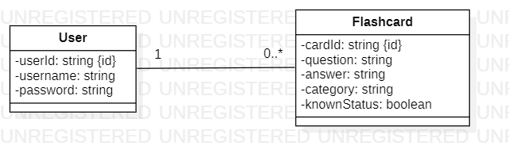

# <h1>merken</h1>*
This project has been developed by students at ESILV Paris, aiming to provide a website that enables users to effectively manage their flashcards. We are well aware of the benefits of flashcards, particularly in aiding memory retention, especially among students.


## Modeling



Repositroy Link (Github) : https://github.com/ahmedmaaloul/flashcard_sys
## Installation

- First you need to have access to :
    - PostgresQL. (If you don't have it, you downlad it [here](https://www.postgresql.org/download/)).</br>
      Be sure to have the bin file in your PATH variable to be able to run some commands afterwards.
    - NodeJS (Download it [here](https://nodejs.org/en/download), if you don't have it)

- Now, clone the github repository in the file you want :</br>
```bash
git clone https://github.com/ahmedmaaloul/flashcard_sys.git
```
- Run this to change the directory:
```bash
cd ./backend-nodejs
```
Then, run this following command to initialize Node
  ```bash
npm i
  ```
  - Do the same thing with the frontend folder on the second terminal :
```bash
cd ./frontend-angular
```
```bash
 npm i
```

- Before starting the app, you will need to synchronize the database.
    - On PgAdmin (for PostgresQL), create a user ```flashcard_user``` with a password ```onepiece```.</br>
      Then create a database ```flashcard_db``` and give your user access to it.
    - Now that you have our database and our user, run this command in the directory /flashcard_sys :
  ```bash 
      psql -U flashcard_user -d flashcard_db -f outputfile.sql
  ```
- Now that the database is synchronized, you can initialize the app.</br>
  For this, open two terminals:</br>
- On the first terminal run:
  ```bash
    npm start
  ```
  On the second terminal:
  ```bash
    ng serve
  ```
You can now run the app on your browser at this url : http://localhost:4200/ .</br>

## Utilisation
You are now on the website.
Connect with any username/password, you can create flashcards and hve access to the ones already present in the database.
Feel free to discover the project, explore the code and change its content to see and understand the different structures used.

## Contributions

This project has been developed by [Ahmed Malloul](https://github.com/ahmedmaaloul), [Jade Bettoya](https://github.com/jadebettoya) and [Thibault Biville](https://github.com/jackBlaster).


<small>*merken = memorize</small>


