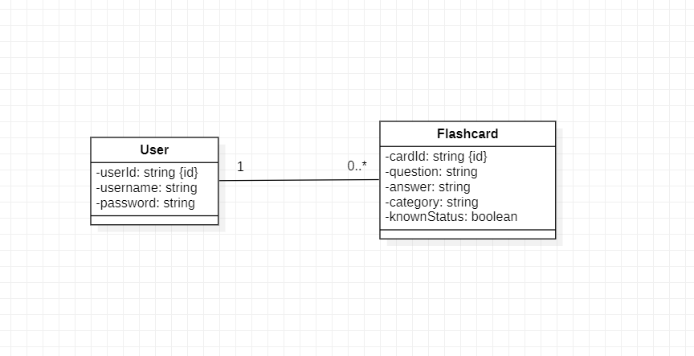

# <h1>merken*</h1>
This project has been developed by students at ESILV Paris, aiming to provide a website that enables users to effectively manage their flashcards. We are well aware of the benefits of flashcards, particularly in aiding memory retention, especially among students.

Repositroy Link (Github) : https://github.com/ahmedmaaloul/flashcard_sys

## Modeling

## Highlights
In this project, we used 2 advanced features !. We have used HighCharts and AG Grid

Pie chart :

Dashboard using AG Grid :

## Interfaces

Home page

Dashboard page

Create Flashcard Page

Update Flashcard Page

View Flashcard Page

## Contributions

This project has been developed by [Ahmed Malloul](https://github.com/ahmedmaaloul), [Jade Bettoya](https://github.com/jadebettoya) and [Thibault Biville](https://github.com/jackBlaster).

<small>*merken = memorize</small>

